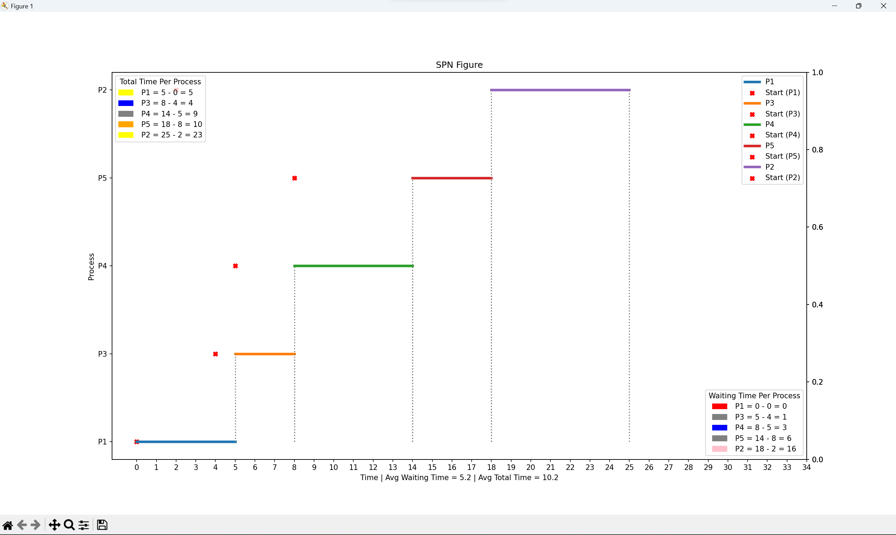

# CPU Scheduling Algorithm

## Overview

This Python program implements various CPU scheduling algorithms, including First-Come, First-Served (FCFS), Shortest Process Next (SPN), Highest Response Ratio Next (HRRN), and Round Robin. These algorithms simulate the process of selecting a process from the ready queue for execution on the CPU. CPU scheduling is a fundamental aspect of operating systems, and this project provides a practical implementation of different scheduling algorithms.

## Technologies
[](https://matplotlib.org/)
[](https://pandas.pydata.org/)
[](https://www.djangoproject.com/)

## Prerequisites

Ensure you have [Python](https://www.python.org/downloads/) installed. You can install the required packages using:

You can install them using:

```bash
pip install -r requirements.txt
```

## Usage
Run the Django server:
```bash
python manage.py runserver
```
Open your web browser and go to http://localhost:8000.

Enter Arrival Time (AT) and CPU Burst Time (CBT) for each process.

Select a scheduling algorithm from the provided options.

Click on the "Submit" button.

The program will calculate and display the results, including Gantt charts and turnaround time.

## Project Snapshots


